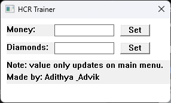

# Hill Climb Racing Trainer 🛠️

A simple trainer for **Hill Climb Racing** (PC version) to modify in-game **Money** and **Diamonds**.

## 🚀 How to Use
1. Launch **Hill Climb Racing** (PC version).
2. Run this trainer.
3. Enter the desired amount of money/diamonds.
4. Click `Set`.

> 💡 Note: Values only update when you are in the **main menu** of the game.

## Screenshot

## 👨‍💻 Author
- [Adithya5434](https://github.com/Adithya5434)
- [Advik](https://github.com/Advik-B)

## 📜 License
This project is licensed under the [MIT License](LICENSE.txt).

(idk why I made this... no one plays this game nowadays)
